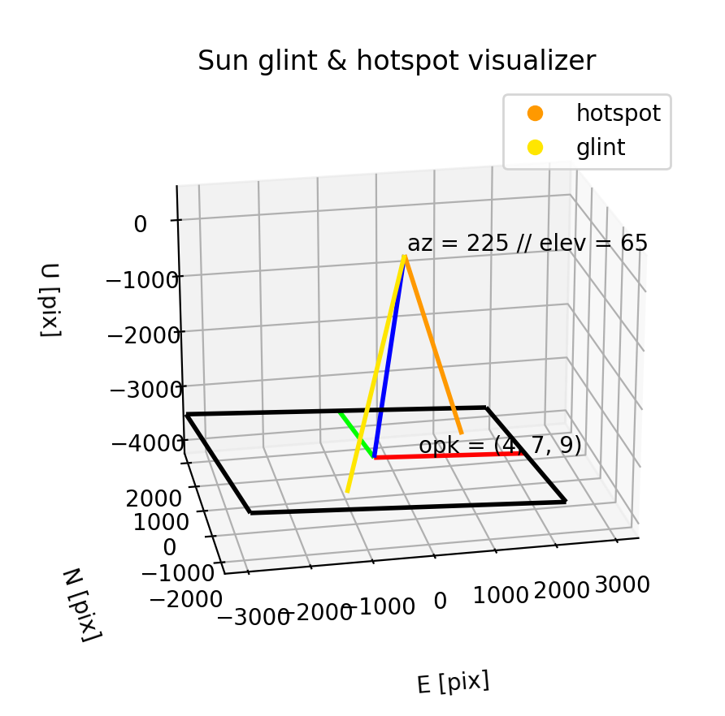

# Sun glint and hotspot visualizer

## Purpose
This script is intended for use to visualize where sun hotspot and sun glint will be present in an image taken over a horizontal surface (e.g. water). This script only *visualizes* where the hotspot and glint will be; it does not solve for the image coordinates of either.

## Hotspot and glint
Hotspot is produced from the direct alignment of the camera with the sun. Glint is produced by a specular surface and is the result of sunlight reflecting from the surface to the camera ([Ortega-Terol *et al.* 2017](https://doi.org/10.3390/s17102352)). 

## How to use
This script requires a number of libraries available in the Conda base environment. Therefore this script should run using the default installation of [Anaconda](https://www.anaconda.com/products/distribution). Running the script from the Spyder IDE is the simplest way to use it.

The user is prompted in the terminal for input on sun azimuth and elevation (separated by a space), and then for image rotation (omega phi kappa, all separated by spaces). A 3D plot window will then show, visualizing the sun hotspot and glint with respect to the rotated image.

```sh
$ [path to Anaconda python] hotspot_glint_viz.py 
Sun: azimuth and elevation [deg]: 225 65
Image: omega phi kappa [deg]: 4 7 9
```



## givens3D.py
`givens3D.py` is a function I wrote to facilitate building rotation matrices from the ground up. By default, this function produces a direct rotation matrix, which is the standard for rotating vectors. The photogrammetric standard of performing inverse rotations (i.e., rotations of space) can be performed by adding `inverse=True`. Within the visualizer script, you can see how I choose to build the full rotation matrix from a series of sequential rotations about the axes (note that these are direct rotations for visualization purposes, not the photogrammetric standard of inverse rotations!):
```py
rotmat_o = givens3D('x', omega)
rotmat_p = givens3D('y', phi)
rotmat_k = givens3D('z', kappa)

rotmat = rotmat_k @ rotmat_p @ rotmat_o
```
